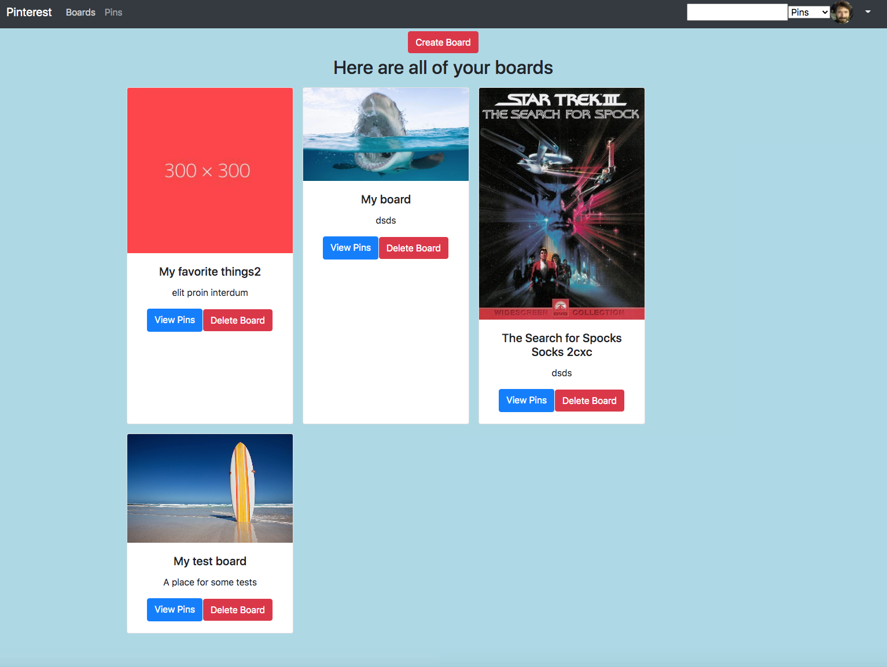
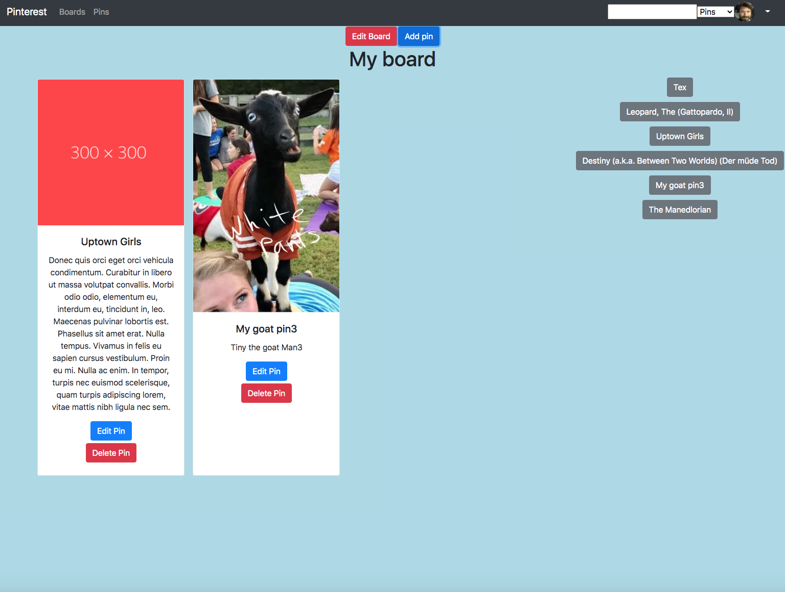

# React Pinterest

## Motivation

The motivation behind this project was to make a mock version of pinterest to practice crud functionality in React

## Build status

MVP

## Code Style

React, Javascript ES6,
Bootstrap, Firebase, axios

[https://upbeat-mahavira-a8e825.netlify.app/](https://upbeat-mahavira-a8e825.netlify.app/)

## Screenshots:





## Features

This site has a way to do crud functionality on Boards and Pins: Create, read, update and delete. I can also add pins to boards.

Not implemented (to do):

- Search
- Hiding Edit controls on logout
- Making delete Pin from Board different from delete pin

## Code Example

```
ccomponentDidMount() {
    // 1. Pull boardId from URL params
    const boardId = this.props.match.params.id;
    // 2. Make a call to the API that gets the board info
    this.getBoardInfo(boardId);

    // 3. Make a call to the API that returns the pins associated with this board and set to state.
    this.findPinsForBoard(boardId)
      .then(resp => {
        this.setState({
          pins: resp,
          show: false
        });
      })
      .catch(error => console.warn(error));

    // Fetch all the pins ahead of time to allow users to choose to add them:
    this.getterAllPins();
  }
```

## Team

Will Kotheimer

#### How to use locally

You must create a firebase. Add Rules to the database similar to the following:

```
{
  "rules": {
    ".read": true,
    ".write": true,
       "users": {
      ".indexOn": ["uId"],
    },
    "boards": {
      ".indexOn": ["userId"],
    },
    "pins": {
      ".indexOn": ["userId"],
    },
    "pins-board": {
      ".indexOn": ["boardId"]
    }
  }
}

```

Get the firebaseConfig variables from the Project Overview [Gear Icon] -> Project Settings -> General tab. Once you have these you can add these to your project as outlined below:

## Create the `.env` file
1. In the ROOT of your application, create a `.env` file
1. Add `.env` to your `.gitignore` file
1. Place the following in that file with your keys as the values
```
REACT_APP_API_KEY=XXX
REACT_APP_AUTH_DOMAIN=XXX
REACT_APP_DATABASE_URL=XXX
REACT_APP_PROJECT_ID=XXX
REACT_APP_STORAGE_BUCKET=XXX
REACT_APP_MESSAGING_SENDER_ID=XXX
REACT_APP_APP_ID=XXX
REACT_APP_MEASUREMENT_ID=XXX
```

## Create the `apiKeys.js` file
1. Create `apiKeys.js` in your `helpers` directory.
1. Place the following in the file:
```
const firebaseConfig = {
  apiKey: process.env.REACT_APP_API_KEY,
  authDomain: process.env.REACT_APP_AUTH_DOMAIN,
  databaseURL: process.env.REACT_APP_DATABASE_URL,
  projectId: process.env.REACT_APP_PROJECT_ID,
  storageBucket: process.env.REACT_APP_STORAGE_BUCKET,
  messagingSenderId: process.env.REACT_APP_MESSAGING_SENDER_ID,
  appId: process.env.REACT_APP_APP_ID,
  measurementId: process.env.REACT_APP_MEASUREMENT_ID,
};

export default firebaseConfig;
```

### How to run it: `npminstall` `npm start`

Runs the app in the development mode.\
Open [http://localhost:3000](http://localhost:3000) to view it in the browser.

The page will reload if you make edits.\
You will also see any lint errors in the console.
